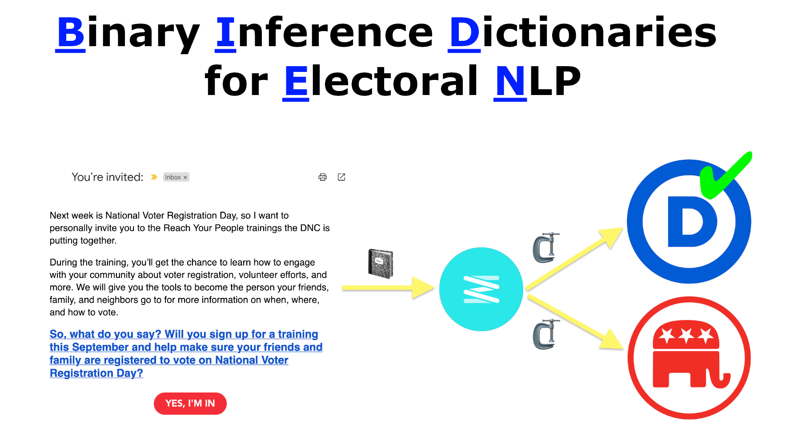

# BIDEN: Binary Inference Dictionaries for Electoral NLP

This is a [Jupyter Notebook](https://github.com/hodgesmr/biden_nlp/blob/main/Binary_Inference_Dictionaries_Electoral_NLP.ipynb) that introduces BIDEN: Binary Inference Dictionaries for Electoral NLP. It demonstrates a compression-based binary classification technique that is fast at both training and inference on common CPU hardware in Python.

It is largely built on the strategies presented by [FTCC](https://github.com/cyrilou242/ftcc), which in turn, was a reaction to [Low-Resource Text Classification: A Parameter-Free Classification Method with Compressors](https://github.com/bazingagin/npc_gzip) (the gzip method). Like FTCC, **BIDEN** is built atop of [Zstandard](https://facebook.github.io/zstd/) (Zstd), which leverages [dictionary compression](https://facebook.github.io/zstd/#small-data). Zstd dictionary compression seeds a compressor with sample data, so that it can efficiently compress _small data_ (~1 KB) of similar composition. Seeding the compressor dictionaries acts as our "training" method for the model.

The **BIDEN** model was trained on the [ElectionEmails 2020](https://electionemails2020.org) data set — a database of over 900,000 political campaign emails from the 2020 US election cycle. **In compliance with the data set's [terms](https://electionemails2020.org/downloads/corpus_documentation_v1.0.pdf), the training data is NOT provided with this repository.** If you would like to train the **BIDEN** model yourself, you can [request a copy of the data for free](https://docs.google.com/forms/d/e/1FAIpQLSdcgjZo-D1nNON4d90H2j0VLtTdxiHK6Y8HPJSpdRu4w5YILw/viewform). The **BIDEN** model was trained on `corpus_v1.0`.

It also demonstrates success at fast partisan classification for tweets and samples from the [campaign email database](https://political-emails.herokuapp.com/emails) maintained by [Derek Willis](https://www.thescoop.org).

## License

All code is provided under the [BSD 3-Clause license](https://github.com/hodgesmr/biden_nlp/blob/main/LICENSE).

## A Matt Hodges project

This project is maintained by [@MattHodges](https://mastodon.social/@MattHodges).

_Please use it for good, not evil._
